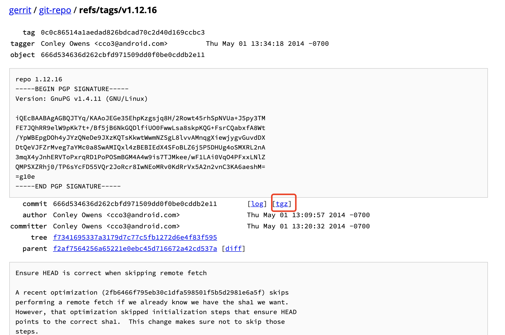

# repo gpg: 无法检查签名：No public key

[TOC]

## 错误信息


repo   >> gpg: 无法检查签名：No public key 

``` bash
repo init -u https://source.codeaurora.org/quic/la/platform/manifest.git -b release -m LA.UM.7.6.r1-02000-89xx.0.xml --repo-url=git://codeaurora.org/tools/repo.git --repo-branch=caf-stable

Downloading Repo source from git://codeaurora.org/tools/repo.git
remote: Enumerating objects: 17, done.
remote: Counting objects: 100% (17/17), done.
remote: Compressing objects: 100% (17/17), done.
remote: Total 5877 (delta 6), reused 0 (delta 0), pack-reused 5860
repo: Updating release signing keys to keyset ver 2.3
repo: error: "git" failed with exit status 1
  cwd: /Volumes/AndroidSource/Sc60Android9/.repo/repo
  cmd: ['git', 'tag', '-v', 'v1.12.16']
  stdout:
  >> object 666d534636d262cbfd971509dd0f0be0cddb2e11
  >> type commit
  >> tag v1.12.16
  >> tagger Conley Owens <cco3@android.com> 1398976458 -0700
  >>
  >> repo 1.12.16
  stderr:
  >> gpg: 签名建立于 五  5/ 2 04:34:18 2014 CST
  >> gpg:               使用 RSA 密钥 67B7E448692B382C
  >> gpg: 无法检查签名：No public key
fatal: cloning the git-repo repository failed, will remove '.repo/repo'
```

## 如何解决

**Step 1 ** 

流畅的国际网络

**Step 2 **

下载合适的版本，https://gerrit.googlesource.com/git-repo/

如，我这里需要用的`V1.2.16`




**Step 3** 

解压，替换下载的`repo`


done!