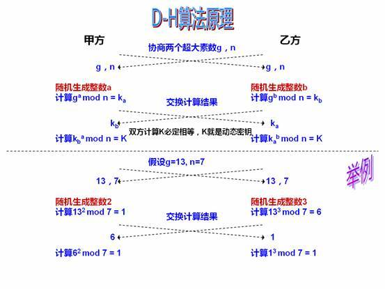

# 密码与摘要


## 对称加密

- 7种分组加密算法

AES、DES、Blowfish、CAST、IDEA、RC2、RC5

- [分组密码](https://baike.baidu.com/item/分组密码)加密模式

电子密码本模式（ECB）、加密分组链接模式（CBC）、加密反馈模式（CFB）和输出反馈模式（OFB）四种常用的

### AES

Advanced Encryption Standard,高级加密标准


## 非对称加密算法

加密和解密可以使用不同的规则，只要这两种规则之间存在某种对应关系即可，这样就避免了直接传递密钥.

- DH算法一般用于密钥交换。
- DSA算法一般只用于数字签名。
- RSA算法既可以用于密钥交换，也可以用于数字签名，当然，如果你能够忍受其缓慢的速度，那么也可以用于数据加密。
- 椭圆曲线算法（ECDSA）.


DSA解密速度通常很快，但加密较慢，而RSA则相反。

且以现在机算机的算力，DSA 1024-bit已经实际上可破解，建议不使用。


**数字签名**

在ISO7498—2标准中定义为：“附加在数据单元上的一些数据，或是对数据单元所作的密码变换，这种数据和变换允许数据单元的接收者用以确认数据单元来源和数据单元的完整性，并保护数据，防止被人（例如接收者）进行伪造”。

### DH

Diffie-Hellman,秘钥（协商）交换算法

数学原理:离散对数



### DSA

Digital Signature Algorithm，数字签名算法

数学原理:离散对数

发送者使用自己的私钥对文件或消息进行签名，接受者收到消息后使用发送者的公钥来验证签名的真实性。DSA只是一种算法，和RSA不同之处在于它不能用作加密和解密，也不能进行密钥交换，只用于签名,它比RSA要快很多.


### RSA

Rivest-Shamir Adelman

数学原理：最大质因数分解，[RSA算法原理](http://www.ruanyifeng.com/blog/2013/06/rsa_algorithm_part_one.html)

**加解密:**

```bash
# 生成密钥对，即公钥和私钥
  1.随机质数  P Q
  2.乘积 		 n = P * Q 。
    欧拉函数  m =  (P - 1)(Q - 1)
  3.随机正数  e 
    1<e<m , e 与 m 互质
  4.模板反元素 d
    (e * d ) % m = 1
  公钥(n , e) 私钥（n ,d ）  
# 加密
	a^e % n = b
# 解密
	b^d % n = a
		
	
	
# 其中， 3.随机整数 `e` 既是 `public exponent` , 一般取65537;

```


**明文长度/密文长度/密钥长度:**

```bash
#明文大小指二进制数据的整数大小
明文大小 x :0<x<n	,当x>n时，运算出错.
所以会在明文前面padding 0以保证不会大于n，PKCS建议padding len = 11字节.
所以，`1024bit密钥`可用明文长度= 128B -11B = 117 字节
```

**工作方式：**

1.Bob获取Alice公钥

2.Bob用Alice公钥加密

3.Alice用私钥解密

## 信息摘要

**(散列值.Message digest)**

OpenSSL实现了5种信息摘要算法，分别是MD2、MD5、MDC2、SHA（SHA1）和RIPEMD。SHA算法事实上包括了SHA和SHA1两种信息摘要算法。此外，OpenSSL还实现了DSS标准中规定的两种信息摘要算法DSS和DSS1。

### MD5

Message-Digest Algorithm,信息摘要算法

一种被广泛使用的[密码散列函数](https://baike.baidu.com/item/密码散列函数/14937715)，可以产生出一个128位（16字节）的散列值（hash value），用于确保信息传输完整一致。

1996年后该算法被证实存在弱点，可以被加以破解，对于需要高度安全性的数据，专家一般建议改用其他算法，如[SHA-2](https://baike.baidu.com/item/SHA-2/22718180)。2004年，证实MD5算法无法防止碰撞（collision），因此不适用于安全性认证，如[SSL](https://baike.baidu.com/item/SSL/320778)公开密钥认证或是[数字签名](https://baike.baidu.com/item/数字签名/212550)等用途。

流程：

最终得到128bit==16字节。输出为长度32的HexString

### SHA

Secure Hash Algorithm , 安全散列算法

**SHA1**

SHA-1可以生成一个被称为消息摘要的160位（20字节）散列值，散列值通常的呈现形式为40个十六进制数。

自2010年以来，许多组织建议用[SHA-2](https://baike.baidu.com/item/SHA-2)或SHA-3来替换SHA-1。

**SHA2**

SHA-256算法的输入是最大长度小于2^64位的消息，输出是256位的消息摘要，输入消息以512位的分组为单位进行处理。


## Other

两次异或可还原

